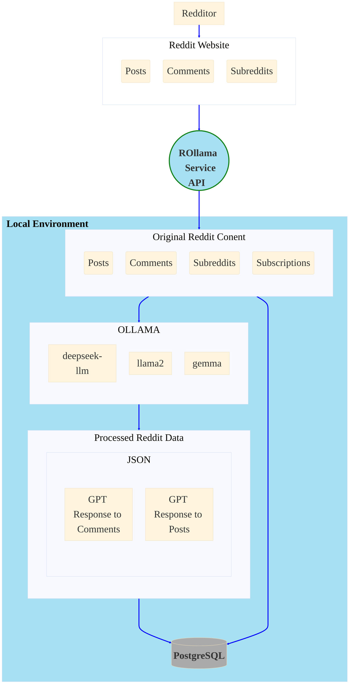
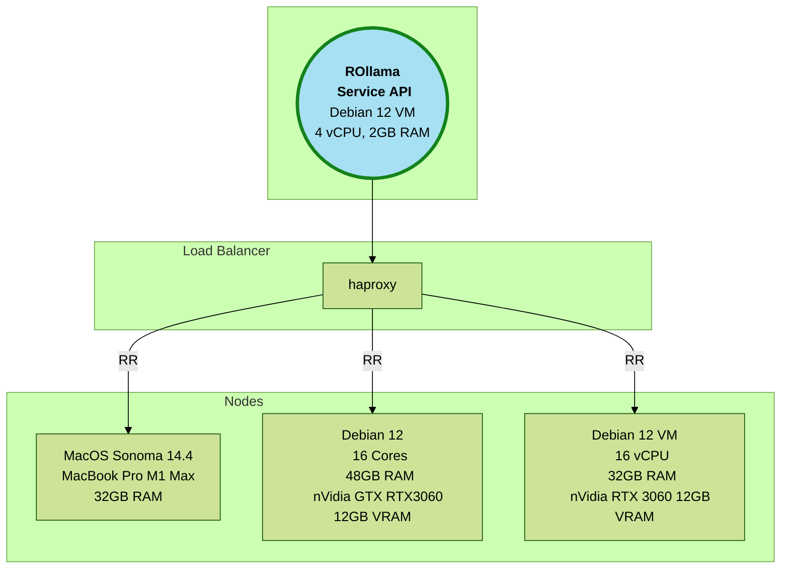
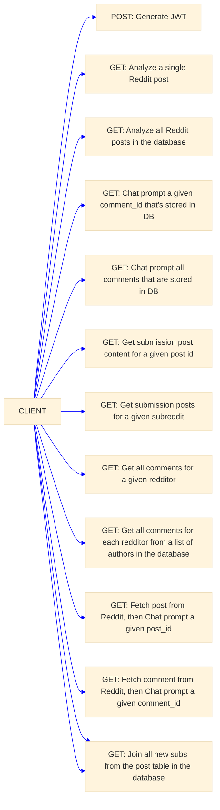
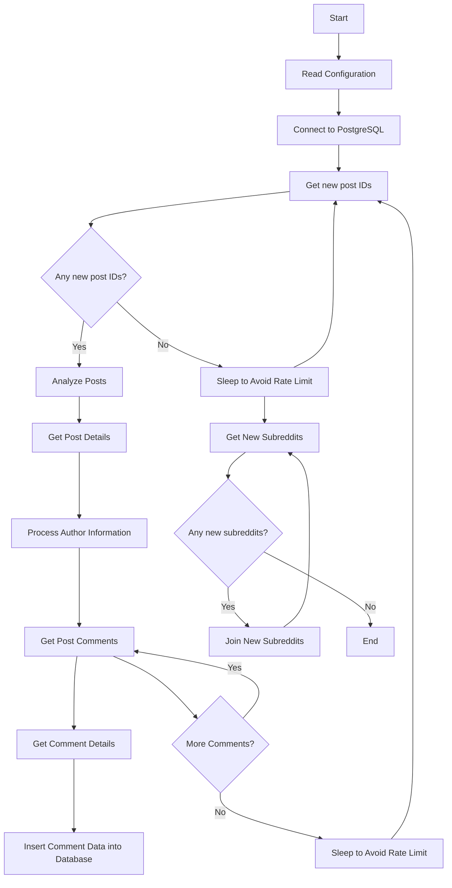
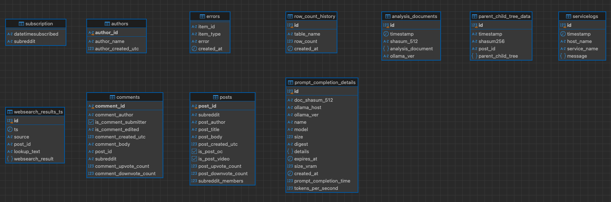
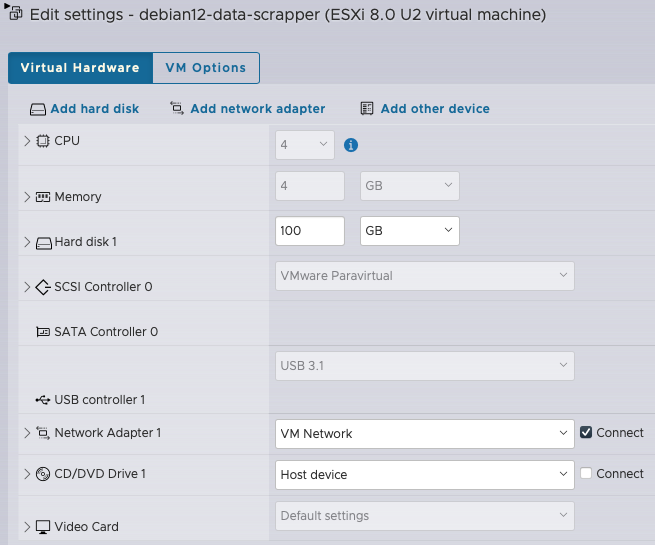
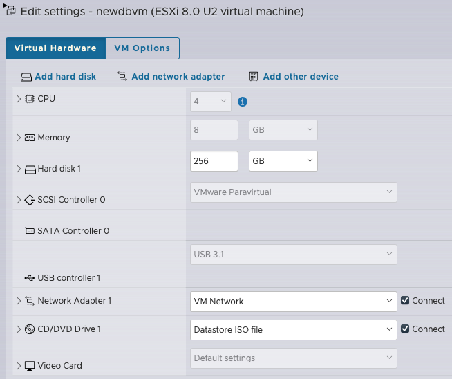

## ROLLAMA-GPT

### General Overview


#### Environment Configuration


#### API Overview

  
**From Reddit**:
* Service collects
  - submissions
  - comments for each submission
  - author of each submission
  - author of each comment to each submission
  - and all comments for each author.
*  Subscribes to subreddit that a submission was posted to

### Build
```shell
> pip3 install -r requirements.txt --quiet
> ./build.sh
Creating directory: builds/0.1.65
Building rollama-0.1.65.tar
Compressing rollama-0.1.65.tar
rollama-0.1.65.tar.gz Done
Build Info
builds/0.1.65
├── BUILD_INFO.TXT
├── Dockerfile
├── build_docker.py
├── docker_install_srvc.sh
├── install_srvc.sh
├── rollama-0.1.65.tar.gz
├── setup.config.template
└── ver.txt

1 directory, 8 files
SERVICE=rollama
VERSION=0.1.65
PACKAGE=rollama-0.1.65.tar.gz
PKGSHA256=cd5fa64d87afe1238e1ce65dc9212ccfb070071e370d026b453b52967c0896b5
SRVC_DIR=/usr/local/rollama/
```

* Copy the contents of the builds/x.x.x directory over to the target machine
```shell
scp -r builds/0.1.65 <remote host>:/var/tmp/
```
* Update **_setup.config_** with secrets and service keys
  * Where applicable you can generate strong secrets using **openssl**
  ```shell
  > openssl rand -base64 28
  pjo2OaLXlTHXZj4jtOa+3b4JEUqcmKz7C8IJJg=
  ```
* For example **setup.config**
```shell
[service]
...
APP_SECRET_KEY=pjo2OaLXlTHXZj4jtOa+3b4JEUqcmKz7C8IJJg=
...
```
### Docker build (tested only on Debian 12 for now)
```shell
./build_docker.py
Building Docker image rollama:0.1.65 from /var/tmp/0.1.65...
sha256:275958fcd3a7a049cc465fbe556802ba40d8cf9fff58ffd4da0593b85d5dca1a
Docker image rollama:0.1.65 built successfully!
```

**OR**

### SYSTEMD install on a Debian 12 host
* For now you have to be logged in as a root user: On the machine run 
```shell
> ./install_srvc.sh

Install Pkg
Group rollama already exists.
User rollama already exists.
Creating directory: /usr/local/rollama/
tar xfz ./rollama-0.1.47.tar.gz -C /usr/local/rollama/ 2> /dev/null
Setting up Service
Creating directory: /etc/rollama/
Created symlink /etc/systemd/system/multi-user.target.wants/rollama.service → /etc/systemd/system/rollama.service.
```
* Remember to edit and update **_/etc/rollama/setup.config_**
* May want to also create SSL cert/key - copy the cert/key in the
**_/usr/local/rollama/_** directory
  
* Start Service
```shell
> systemctl status rollama
○ rollama.service - Rollama-GPT
     Loaded: loaded (/etc/systemd/system/rollama.service; enabled; preset: enabled)
     Active: inactive (dead)

> systemctl start rollama
> systemctl status rollama
● rollama.service - Rollama-GPT
     Loaded: loaded (/etc/systemd/system/rollama.service; enabled; preset: enabled)
     Active: active (running) since Thu 2024-05-02 11:22:48 PDT; 2s ago
   Main PID: 2644 (bash)
      Tasks: 4 (limit: 4649)
     Memory: 87.9M
        CPU: 534ms
     CGroup: /system.slice/rollama.service
             ├─2644 bash /usr/local/rollama/run_srvc.sh
             ├─2645 /usr/bin/python3 /usr/local/bin/gunicorn rollama:app --bind 0.0.0.0:5001 --timeout 2592000 --workers 2 --log-level info
             ├─2646 /usr/bin/python3 /usr/local/bin/gunicorn rollama:app --bind 0.0.0.0:5001 --timeout 2592000 --workers 2 --log-level info
             └─2647 /usr/bin/python3 /usr/local/bin/gunicorn rollama:app --bind 0.0.0.0:5001 --timeout 2592000 --workers 2 --log-level info

May 02 11:22:48 debian systemd[1]: Started rollama.service - Rollama-GPT.
May 02 11:22:48 debian run_srvc.sh[2644]: SSL CERT/KEY cert.pem and key.pem not found. Running unsecured HTTP
May 02 11:22:48 debian run_srvc.sh[2645]: [2024-05-02 11:22:48 -0700] [2645] [INFO] Starting gunicorn 22.0.0
May 02 11:22:48 debian run_srvc.sh[2645]: [2024-05-02 11:22:48 -0700] [2645] [INFO] Listening at: http://0.0.0.0:5001 (2645)
May 02 11:22:48 debian run_srvc.sh[2645]: [2024-05-02 11:22:48 -0700] [2645] [INFO] Using worker: sync
May 02 11:22:48 debian run_srvc.sh[2646]: [2024-05-02 11:22:48 -0700] [2646] [INFO] Booting worker with pid: 2646
May 02 11:22:48 debian run_srvc.sh[2647]: [2024-05-02 11:22:48 -0700] [2647] [INFO] Booting worker with pid: 2647

```

**Deployed as WSGI**  
*  Uses Gunicorn WSGI

#### How-to Run this
* Install Python Modules:
    > pip3 install -r requirements.txt

* Get Reddit API key: https://www.reddit.com/wiki/api/

* Gen SSL key/cert for secure connection to the service
    > openssl req -x509 -newkey rsa:4096 -nodes -out cert.pem -keyout key.pem -days 3650

* Gen Symmetric encryption key for encrypting any text
   > ./tools/generate_keys.py
   > Encrption Key File text_encryption.key created

* Create Database and tables:
    See **reddit.sql**

### Install Ollama-gpt 

#### Linux
* https://github.com/ollama/ollama/blob/main/docs/linux.md

* Sample Debian Service config file: /etc/systemd/system/ollama.service
```shell
[Service]
Environment="OLLAMA_HOST=0.0.0.0"
..
..
..

```

#### MacOS
* I installed Ollama-gpt on my MacMini M1 - using brew
```shell
> brew install ollama
```
* Start/Stop Service
```shell
> brew services start ollama
> brew services stop ollama
```

**Bind Ollama server to local IPV4 address**

* create a run shell script
  ```shell
  > /opt/homebrew/opt/ollama/bin
  ```
* Create a script named **ollama.sh** add the following
  ```shell
  #!/usr/bin/env bash
  export OLLAMA_HOST=0.0.0.0
  /opt/homebrew/bin/ollama $1
  ```
* Make script "executable"
  ```shell
  chmod +x ollama.sh
  ```
* Edit .plist file for the ollama homebrew service
  ```shell
    > cd /opt/homebrew/Cellar/ollama
    > cd 0.1.24 #this may be different for your system
    > vi homebrew.mxcl.ollama.plist
  ```
* Change original line
  > <string>/opt/homebrew/opt/ollama/bin/ollama</string>

    TO this:
  > <string>/opt/homebrew/opt/ollama/bin/ollama.sh</string>
* Save file
* stop/start service
  ```shell
  > brew services stop ollama && brew services start ollama
  ```
* Add following models to ollama-gpt: deepseek-llm,llama2,llama-pro 
  ```shell
  > for llm in deepseek-llm llama2 llama-pro gemma
    do
        ollama pull ${llm}
    done
  ```
* Update setup.config with pertinent information (see setup.config.template)
  ```text
     # update with required information and save it as
     #	setup.config file
    [psqldb]
    host=
    port=5432
    database=
    user=
    password=

    [reddit]
    client_id=
    client_secret=
    username=
    password=
    user_agent=

    [service]
    JWT_SECRET_KEY=
    SRVC_SHARED_SECRET=
    IDENTITY=
    APP_SECRET_KEY=
    ENDPOINT_URL=
    OLLAMA_API_URL=
    LLMS=
    ENCRYPTION_KEY=
  ```

* Run Rollama-GPT Service:
    (see https://docs.gunicorn.org/en/stable/settings.html for config details)
```shell
    > gunicorn --certfile=cert.pem \
               --keyfile=key.pem \
               --bind 0.0.0.0:5000 \
               rollama:app \
               --timeout 2592000 \
               --threads 4 \
               --reload
```
* Customize it to your hearts content!


* **LICENSE**: The 3-Clause BSD License - license.txt


* **TODO**:
    - Add Swagger Docs
    - Add long running task queue
        - Queue: task_id, task_status, end_point
    - Revisit Endpoint logic add robust error handling
    - Add scheduler app - to schedule some of these events
        - scheduler checks whether or not a similar tasks exists
    - Add logic to handle list of lists with NUM_ELEMENTS_CHUNK elements
        - retry after 429
        - break down longer list of items into list of lists with small
            chunks

#### Example
* These examples assume that environment variable **API_KEY** is using a valid API_KEY


**Get All comments for all Redditors in the database**
```shell
> export api_key=<api_key>
>
> export AT=$(curl -sk -X POST -H "Content-Type: application/json" -d '{"api_key":"'${api_key}'"}' \
  https://127.0.0.1:5000/login | jq -r .access_token) && curl -sk -X GET -H \
  "Authorization: Bearer ${AT}" 'https://127.0.0.1:5000/get_authors_comments'
```
**On Service Console**:
```shell
    INFO:root:Getting comments for Redditor
    INFO:root:Redditor 916 new comments
    INFO:root:Processing Author Redditor
    INFO:root:Processing Author Redditor
    INFO:root:Processing Author Redditor
    INFO:root:Processing Author Redditor
```
**Analyze a Post using Post ID that already exists in a post table in the database**
```shell
> export AT=$(curl -sk -X POST -H "Content-Type: application/json" -d '{"api_key":"'${API_KEY}'"}' \
  https://127.0.0.1:5001/login | jq -r .access_token) && curl -sk -X GET -H \
  "Authorization: Bearer ${AT}" 'https://127.0.0.1:5001/analyze_post?post_id=<Reddit Post ID>'
```
**Get and Analyze a Post using Post ID that has not yet been added to the post table in the database**
```shell
> export AT=$(curl -sk -X POST -H "Content-Type: application/json" -d '{"api_key":"'${API_KEY}'"}' \
  https://127.0.0.1:5001/login | jq -r .access_token) && curl -sk -X GET -H \
  "Authorization: Bearer ${AT}" 'https://127.0.0.1:5001/get_and_analyze_post?post_id=<Reddit Post ID>'
```

### General Workflow


#### Database Schema


#### llama-gpt VM config 

*nVidia GTX-1070i 8GB in Passthrough Mode*


#### Reddit Data Scraper Service VM config


#### PostgreSQL VM config

