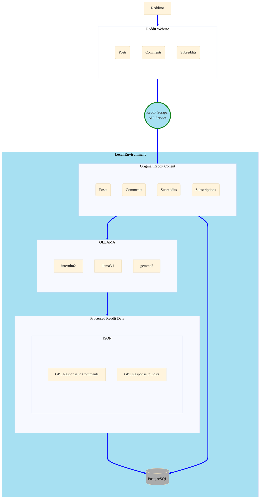
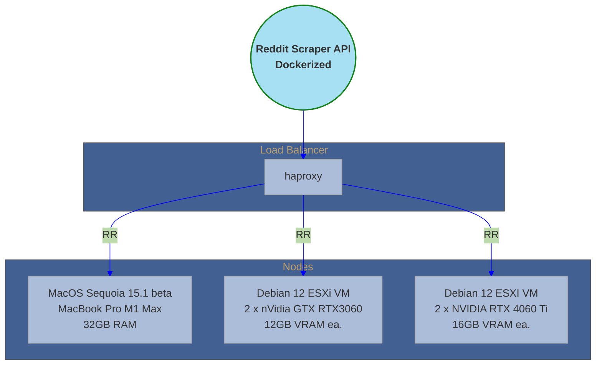

## ROLLAMA-GPT
©2024, Ovais Quraishi

### General Overview



#### Environment Configuration



#### API Overview


**From Reddit**:

* Service collects
   - submissions
   - comments for each submission
   - author of each submission
   - author of each comment to each submission
   - and all comments for each author.

* Subscribes to subreddit that a submission was posted to
* Title and content of each post, and content of each comment are prompted for a response
    response by LLMS (llama3.1, gemma2, and internlm2), the responses along with metadata
    are stored in PostgreSQL

### Build

```sh {"id":"01J6QKN1V0VMEGDS79WQNHF77A"}
> pip3 install -r requirements.txt --quiet
> ./build.sh
Creating directory: builds/0.1.65
Building rollama-0.1.65.tar
Compressing rollama-0.1.65.tar
rollama-0.1.65.tar.gz Done
Build Info
builds/0.1.65
├── BUILD_INFO.TXT
├── Dockerfile
├── build_docker.py
├── docker_install_srvc.sh
├── install_srvc.sh
├── rollama-0.1.65.tar.gz
├── setup.config.template
└── ver.txt

1 directory, 8 files
SERVICE=rollama
VERSION=0.1.65
PACKAGE=rollama-0.1.65.tar.gz
PKGSHA256=cd5fa64d87afe1238e1ce65dc9212ccfb070071e370d026b453b52967c0896b5
SRVC_DIR=/usr/local/rollama/
```

* Copy the contents of the builds/x.x.x directory over to the target machine

```sh {"id":"01J6QKN1V0VMEGDS79WS01AB00"}
scp -r builds/0.1.65 <remote host>:/var/tmp/
```

* Update ___setup.config___ with secrets and service keys

* Where applicable you can generate strong secrets using **openssl**

```sh {"id":"01J6QKN1V0VMEGDS79WVKFYAZV"}
> openssl rand -base64 28
pjo2OaLXlTHXZj4jtOa+3b4JEUqcmKz7C8IJJg=
```

* For example **setup.config**

```sh {"id":"01J6QKN1V0VMEGDS79WZ1QPQFF"}
[service]
...
APP_SECRET_KEY=pjo2OaLXlTHXZj4jtOa+3b4JEUqcmKz7C8IJJg=
...
```

### Docker build (tested only on Debian 12 for now)

```sh {"id":"01J6QKN1V0VMEGDS79X0HRZZN9"}
./build_docker.py
Building Docker image rollama:0.1.65 from /var/tmp/0.1.65...
sha256:275958fcd3a7a049cc465fbe556802ba40d8cf9fff58ffd4da0593b85d5dca1a
Docker image rollama:0.1.65 built successfully!
```

**OR**

### SYSTEMD install on a Debian 12 host

* For now you have to be logged in as a root user: On the machine run

```sh {"id":"01J6QKN1V18CB6GSWCBRMM9AF7"}
> ./install_srvc.sh

Install Pkg
Group rollama already exists.
User rollama already exists.
Creating directory: /usr/local/rollama/
tar xfz ./rollama-0.1.47.tar.gz -C /usr/local/rollama/ 2> /dev/null
Setting up Service
Creating directory: /etc/rollama/
Created symlink /etc/systemd/system/multi-user.target.wants/rollama.service → /etc/systemd/system/rollama.service.
```

* Remember to edit and update ___/etc/rollama/setup.config___
* May want to also create SSL cert/key - copy the cert/key in the
   ___/usr/local/rollama/___ directory
* Start Service

```sh {"id":"01J6QKN1V18CB6GSWCBVP0SDVY"}
> systemctl status rollama
○ rollama.service - Rollama-GPT
     Loaded: loaded (/etc/systemd/system/rollama.service; enabled; preset: enabled)
     Active: inactive (dead)

> systemctl start rollama
> systemctl status rollama
● rollama.service - Rollama-GPT
     Loaded: loaded (/etc/systemd/system/rollama.service; enabled; preset: enabled)
     Active: active (running) since Thu 2024-05-02 11:22:48 PDT; 2s ago
   Main PID: 2644 (bash)
      Tasks: 4 (limit: 4649)
     Memory: 87.9M
        CPU: 534ms
     CGroup: /system.slice/rollama.service
             ├─2644 bash /usr/local/rollama/run_srvc.sh
             ├─2645 /usr/bin/python3 /usr/local/bin/gunicorn rollama:app --bind 0.0.0.0:5001 --timeout 2592000 --workers 2 --log-level info
             ├─2646 /usr/bin/python3 /usr/local/bin/gunicorn rollama:app --bind 0.0.0.0:5001 --timeout 2592000 --workers 2 --log-level info
             └─2647 /usr/bin/python3 /usr/local/bin/gunicorn rollama:app --bind 0.0.0.0:5001 --timeout 2592000 --workers 2 --log-level info

May 02 11:22:48 debian systemd[1]: Started rollama.service - Rollama-GPT.
May 02 11:22:48 debian run_srvc.sh[2644]: SSL CERT/KEY cert.pem and key.pem not found. Running unsecured HTTP
May 02 11:22:48 debian run_srvc.sh[2645]: [2024-05-02 11:22:48 -0700] [2645] [INFO] Starting gunicorn 22.0.0
May 02 11:22:48 debian run_srvc.sh[2645]: [2024-05-02 11:22:48 -0700] [2645] [INFO] Listening at: http://0.0.0.0:5001 (2645)
May 02 11:22:48 debian run_srvc.sh[2645]: [2024-05-02 11:22:48 -0700] [2645] [INFO] Using worker: sync
May 02 11:22:48 debian run_srvc.sh[2646]: [2024-05-02 11:22:48 -0700] [2646] [INFO] Booting worker with pid: 2646
May 02 11:22:48 debian run_srvc.sh[2647]: [2024-05-02 11:22:48 -0700] [2647] [INFO] Booting worker with pid: 2647

```

**Deployed as WSGI**

* Uses Gunicorn WSGI

#### How-to Run this

* Install Python Modules:

   > pip3 install -r requirements.txt

* Get Reddit API key: https://www.reddit.com/wiki/api/
* Gen SSL key/cert for secure connection to the service

   > openssl req -x509 -newkey rsa:4096 -nodes -out cert.pem -keyout key.pem -days 3650

* Gen Symmetric encryption key for encrypting any text

   > ./tools/generate_keys.py
   > Encrption Key File text_encryption.key created

* Create Database and tables:
   See **reddit.sql**

### Install Ollama-gpt

#### Linux

* https://github.com/ollama/ollama/blob/main/docs/linux.md
* Sample Debian Service config file: /etc/systemd/system/ollama.service

```sh {"id":"01J6QKN1V18CB6GSWCBVZF50XM"}
[Service]
Environment="OLLAMA_HOST=0.0.0.0"
..
..
..

```

#### MacOS

* I installed Ollama-gpt on my MacMini M1 - using brew

```sh {"id":"01J6QKN1V18CB6GSWCBZFWQWEH"}
> brew install ollama
```

* Start/Stop Service

```sh {"id":"01J6QKN1V18CB6GSWCC1KQGN1Z"}
> brew services start ollama
> brew services stop ollama
```

**Bind Ollama server to local IPV4 address**

* create a run shell script

```sh {"id":"01J6QKN1V18CB6GSWCC1QPBHGS"}
> /opt/homebrew/opt/ollama/bin
```

* Create a script named **ollama.sh** add the following

```sh {"id":"01J6QKN1V18CB6GSWCC313FJM7"}
#!/usr/bin/env bash
export OLLAMA_HOST=0.0.0.0
/opt/homebrew/bin/ollama $1
```

* Make script "executable"

```sh {"id":"01J6QKN1V18CB6GSWCC54NWP5H"}
chmod +x ollama.sh
```

* Edit .plist file for the ollama homebrew service

```sh {"id":"01J6QKN1V18CB6GSWCC7NXD2MH"}
  > cd /opt/homebrew/Cellar/ollama
  > cd 0.1.24 #this may be different for your system
  > vi homebrew.mxcl.ollama.plist
```

* Change original line

   > /opt/homebrew/opt/ollama/bin/ollama

   TO this:

   > /opt/homebrew/opt/ollama/bin/ollama.sh

* Save file

* stop/start service

```sh {"id":"01J6QKN1V18CB6GSWCC9BRDQ7Q"}
> brew services stop ollama && brew services start ollama
```

* Add following models to ollama-gpt: deepseek-llm,llama3,llama-pro

```sh {"id":"01J6QKN1V18CB6GSWCC9E22XWF"}
> for llm in deepseek-llm llama3 llama-pro gemma
  do
      ollama pull ${llm}
  done
```

* Update setup.config with pertinent information (see setup.config.template)

```text {"id":"01J6QKN1V18CB6GSWCCDCC3GD4"}
   # update with required information and save it as
   #	setup.config file
  [psqldb]
  host=
  port=5432
  database=
  user=
  password=

  [reddit]
  client_id=
  client_secret=
  username=
  password=
  user_agent=

  [service]
  JWT_SECRET_KEY=
  SRVC_SHARED_SECRET=
  IDENTITY=
  APP_SECRET_KEY=
  ENDPOINT_URL=
  OLLAMA_API_URL=
  LLMS=
  ENCRYPTION_KEY=
```

* Run Rollama-GPT Service:
   (see https://docs.gunicorn.org/en/stable/settings.html for config details)

```sh {"id":"01J6QKN1V18CB6GSWCCE7YB8JM"}
    > gunicorn --certfile=cert.pem \
               --keyfile=key.pem \
               --bind 0.0.0.0:5000 \
               rollama:app \
               --timeout 2592000 \
               --threads 4 \
               --reload
```

* Customize it to your hearts content!
* **LICENSE**: The 3-Clause BSD License - license.txt
* **TODO**:

   - Add Swagger Docs
   - Add long running task queue
      - Queue: task_id, task_status, end_point

   - Revisit Endpoint logic add robust error handling
   - Add scheduler app - to schedule some of these events
      - scheduler checks whether or not a similar tasks exists

   - Add logic to handle list of lists with NUM_ELEMENTS_CHUNK elements
      - retry after 429
      - break down longer list of items into list of lists with small
         chunks

#### Example

* These examples assume that environment variable __API_KEY__ is using a valid API_KEY

**Get All comments for all Redditors in the database**

```sh {"id":"01J6QKN1V18CB6GSWCCF771MD4"}
> export api_key=<api_key>
>
> export AT=$(curl -sk -X POST -H "Content-Type: application/json" -d '{"api_key":"'${api_key}'"}' \
  https://127.0.0.1:5000/login | jq -r .access_token) && curl -sk -X GET -H \
  "Authorization: Bearer ${AT}" 'https://127.0.0.1:5000/get_authors_comments'
```

**On Service Console**:

```sh {"id":"01J6QKN1V18CB6GSWCCHR283KW"}
    INFO:root:Getting comments for Redditor
    INFO:root:Redditor 916 new comments
    INFO:root:Processing Author Redditor
    INFO:root:Processing Author Redditor
    INFO:root:Processing Author Redditor
    INFO:root:Processing Author Redditor
```

**Analyze a Post using Post ID that already exists in a post table in the database**

```sh {"id":"01J6QKN1V18CB6GSWCCJ338MKR"}
> export AT=$(curl -sk -X POST -H "Content-Type: application/json" -d '{"api_key":"'${API_KEY}'"}' \
  https://127.0.0.1:5001/login | jq -r .access_token) && curl -sk -X GET -H \
  "Authorization: Bearer ${AT}" 'https://127.0.0.1:5001/analyze_post?post_id=<Reddit Post ID>'
```

**Get and Analyze a Post using Post ID that has not yet been added to the post table in the database**

```sh {"id":"01J6QKN1V18CB6GSWCCNYHR4E0"}
> export AT=$(curl -sk -X POST -H "Content-Type: application/json" -d '{"api_key":"'${API_KEY}'"}' \
  https://127.0.0.1:5001/login | jq -r .access_token) && curl -sk -X GET -H \
  "Authorization: Bearer ${AT}" 'https://127.0.0.1:5001/get_and_analyze_post?post_id=<Reddit Post ID>'
```

### General Workflow

flowchart TD
    A[Start] --> B[Read Configuration]
    B --> C[Connect to PostgreSQL]
    C --> D[Get new post IDs]
    D --> E{Any new post IDs?}
    E -- Yes --> F[Analyze Posts]
    F --> G[Get Post Details]
    G --> H[Process Author Information]
    H --> I[Get Post Comments]
    I --> J[Get Comment Details]
    J --> K[Insert Comment Data into Database]
    I --> L{More Comments?}
    L -- Yes --> I
    L -- No --> M[Sleep to Avoid Rate Limit]
    E -- No --> N[Sleep to Avoid Rate Limit]
    N --> D
    M --> D
    N --> O[Get New Subreddits]
    O --> P{Any new subreddits?}
    P -- Yes --> Q[Join New Subreddits]
    Q --> O
    P -- No --> R[End]

#### pg_cron settings for scheduling function triggers

__See rollama.sql for PGSQL functions and pg_cron installation__

__Schedule pg_cron jobs__

```sh {"id":"01J6QKN1V18CB6GSWCCQJ58XK2"}
rollama=> SELECT cron.schedule('*/5 * * * *', 'select schedule_update()');
SELECT cron.schedule('*/10 * * * *', $$delete from comments where comment_author = 'AutoModerator'$$);
SELECT cron.schedule('*/10 * * * *', $$delete from posts where post_author = 'AutoModerator'$$);
```

__Confirm that pg_cron jobs are loaded__

```sh {"id":"01J6QKN1V18CB6GSWCCQQ9VJPS"}
rrollama=> select * from cron.job;
 jobid |   schedule   |                           command                           | nodename  | nodeport | database | username | active | jobname
-------+--------------+-------------------------------------------------------------+-----------+----------+----------+----------+--------+---------
    16 | */5 * * * *  | select schedule_update()                                    | localhost |     5432 | rollama  | rollama  | t      |
    24 | */10 * * * * | delete from posts where post_author = 'AutoModerator'       | localhost |     5432 | rollama  | rollama  | t      |
    25 | */10 * * * * | delete from comments where comment_author = 'AutoModerator' | localhost |     5432 | rollama  | rollama  | t      |
```

__unschedule pg_cron jobs__

```sh {"id":"01J6QKN1V18CB6GSWCCQYP0KGP"}
rollama=> SELECT cron.unschedule(<jobid from cron.jobs table>);
```

__Confirm pg_cron job runs__

```sh {"id":"01J6QKN1V18CB6GSWCCV4FNNG8"}
rollama=> select * from cron.job_run_details order by runid desc limit 5;
 jobid | runid | job_pid | database | username |                                                        command                                                         |  status   |                return_message                |          start_time           |           end_time
-------+-------+---------+----------+----------+------------------------------------------------------------------------------------------------------------------------+-----------+----------------------------------------------+-------------------------------+-------------------------------
    25 |   948 |  286605 | rollama  | rollama  | delete from comments where comment_author = 'AutoModerator'                                                            | succeeded | DELETE 2                                     | 2024-07-31 13:00:00.004014-07 | 2024-07-31 13:00:00.191934-07
    16 |   947 |  286604 | rollama  | rollama  | select schedule_update()                                                                                               | succeeded | SELECT 1                                     | 2024-07-31 13:00:00.002889-07 | 2024-07-31 13:00:00.338836-07
    24 |   946 |  286603 | rollama  | rollama  | delete from posts where post_author = 'AutoModerator'                                                                  | succeeded | DELETE 0                                     | 2024-07-31 13:00:00.002287-07 | 2024-07-31 13:00:00.005317-07
```

#### Database Schema


