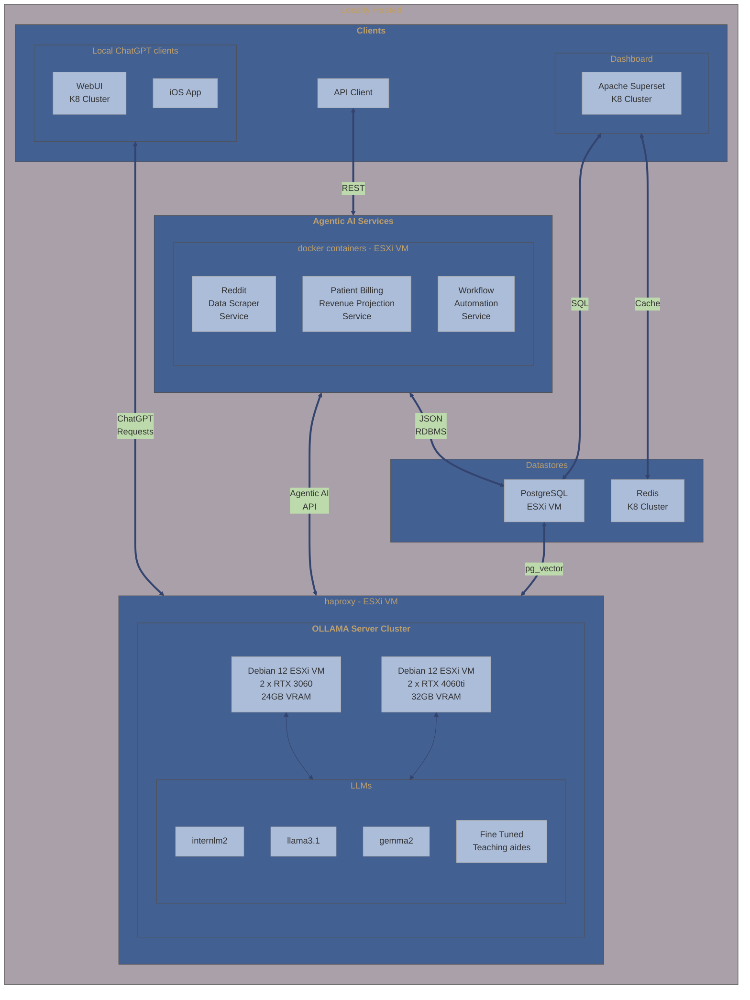

```mermaid
%%{init: {'theme': 'base','themeVariables': {'lineColor': '#33446f', 'primaryColor':'#acbdda','tertiaryColor': '#436092'}}}%%
flowchart TD

    classDef subgraph_padding fill:#aaa0aa,stroke:2px

subgraph Local["`**Locally Hosted**`"]
direction TB
subgraph Clients["`**Clients**`"]
    direction TB
    subgraph family["Local ChatGPT clients"]
    direction TB
        WebUI["WebUI
        K8 Cluster"]
        iOS["iOS App"]
    end
    subgraph dashboard["Dashboard"]
    ApacheSuperset["Apache Superset
    K8 Cluster"]
end
    API["API Client"]
end


    subgraph haproxy["haproxy - ESXi VM"]
    direction TB
    subgraph Ollama["`**OLLAMA Server Cluster**`"]
        direction TB
        dualGPU1["Debian 12 ESXi VM
        2 x RTX 3060 
        24GB VRAM"]
        dualGPU2["Debian 12 ESXi VM
        2 x RTX 4060ti 
        32GB VRAM"]
        subgraph Llms["LLMs"]
        direction TB
        internlm2
        llama3["llama3.1"]
        gemma2
        teaching["Fine Tuned
        Teaching aides"]
        end
    end

end
subgraph Services["`**Agentic AI Services**`"]
    direction TB
    subgraph dockerized["docker containers - ESXi VM"]
        direction TB
        RedditScraper["Reddit
                    Data Scraper 
                    Service"]
        PatientBilling["Patient Billing
                    Revenue Projection
                    Service"]
        WIP["Workflow 
                Automation
                Service"]
    end
end
subgraph datastores["Datastores"]
    direction LR
    PostgreSQL["PostgreSQL
    ESXi VM"]
    Redis["Redis
    K8 Cluster"]
end

end

dashboard <==SQL==> PostgreSQL
dashboard <==Cache==> Redis
PostgreSQL <==pg_vector==> haproxy
Services <==JSON<br>RDBMS==> PostgreSQL

Services <==Agentic AI<br>API==> haproxy

family <==ChatGPT<br>Requests==> haproxy
API <==REST==> Services

dualGPU1 <--> Llms
dualGPU2 <--> Llms


class Local subgraph_padding
```
