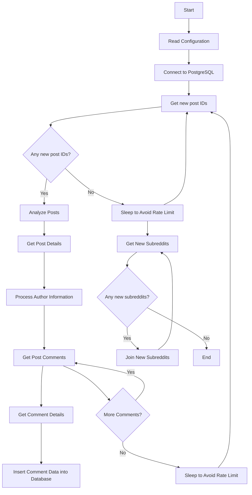

```mermaid
flowchart TD
    A[Start] --> B[Read Configuration]
    B --> C[Connect to PostgreSQL]
    C --> D[Get new post IDs]
    D --> E{Any new post IDs?}
    E -- Yes --> F[Analyze Posts]
    F --> G[Get Post Details]
    G --> H[Process Author Information]
    H --> I[Get Post Comments]
    I --> J[Get Comment Details]
    J --> K[Insert Comment Data into Database]
    I --> L{More Comments?}
    L -- Yes --> I
    L -- No --> M[Sleep to Avoid Rate Limit]
    E -- No --> N[Sleep to Avoid Rate Limit]
    N --> D
    M --> D
    N --> O[Get New Subreddits]
    O --> P{Any new subreddits?}
    P -- Yes --> Q[Join New Subreddits]
    Q --> O
    P -- No --> R[End]
```
